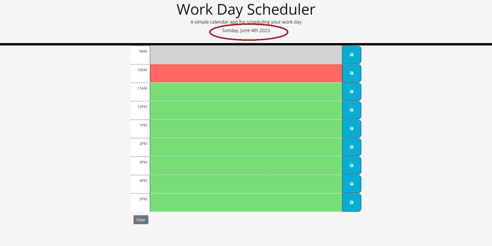
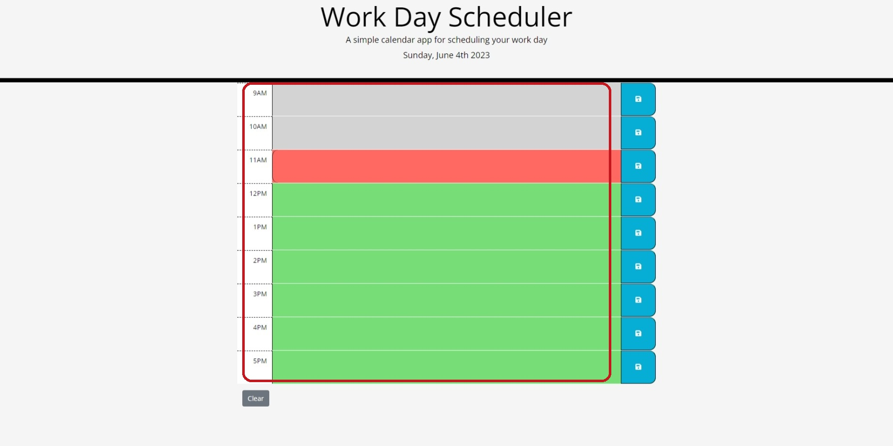
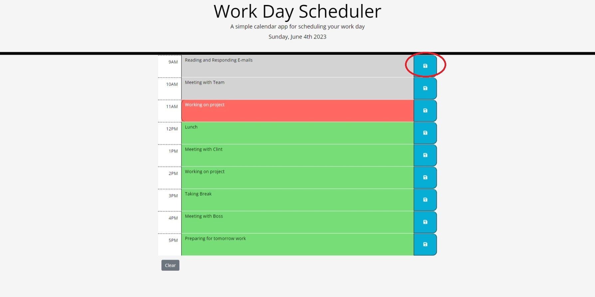
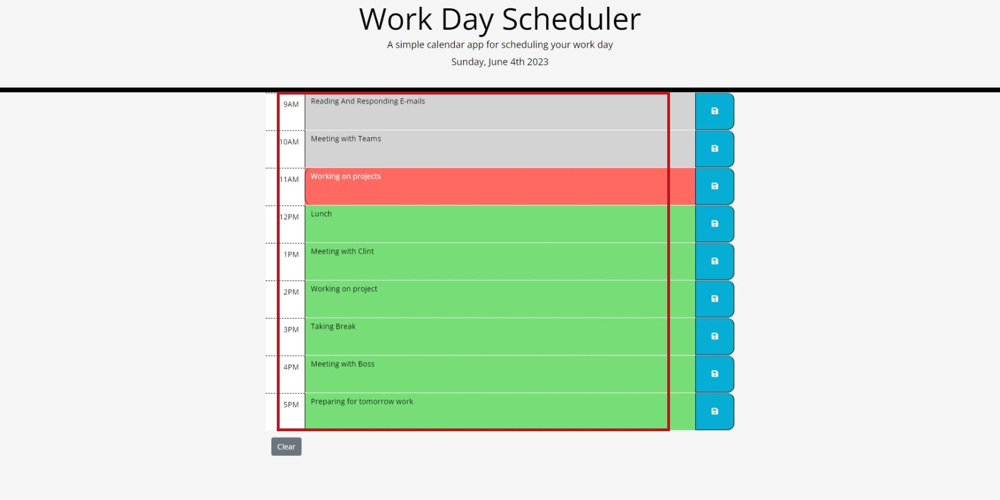
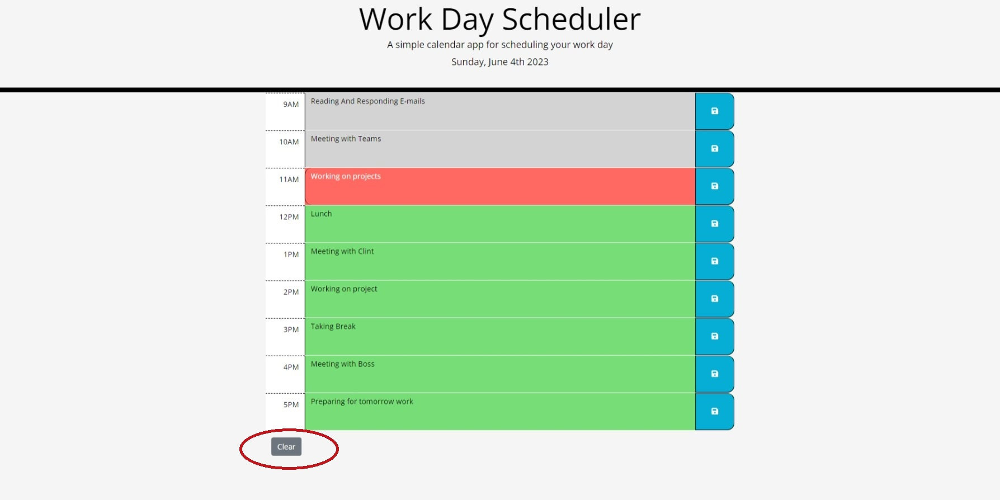

# Description
Work Day Scheduler is a simple calendar application that allows users to save events for each hour of the day.It runs in the browser and features dynamically updated HTML and CSS powered by jQuery. The Moment.js library is used to work with date and time.

## User Story
```
AS AN employee with a busy schedule
I WANT to add important events to a daily planner
SO THAT I can manage my time effectively
```
## Acceptance Criteria
```
GIVEN I am using a daily planner to create a schedule
WHEN I open the planner
THEN the current day is displayed at the top of the calendar
WHEN I scroll down
THEN I am presented with timeblocks for standard business hours
WHEN I view the timeblocks for that day
THEN each timeblock is color coded to indicate whether it is in the past, present, or future
WHEN I click into a timeblock
THEN I can enter an event
WHEN I click the save button for that timeblock
THEN the text for that event is saved in local storage
WHEN I refresh the page
THEN the saved events persist
```
## Usage
 
When a user uses the daily planner to create a schedule:

* When the user opens the planner, the current day is displayed at the top of the calendar. 




* The user is presented with timeblocks for standard business hours;

* When the user views the timeblocks for that day, each timeblock is color-coded to indicate whether it is in the past, present, or future. Past even is in gray, present is in red, and future is in green;





* When the user clicks into a timeblock, the user can enter an event;


* When the user clicks the save button for that timeblock, the text for that event is saved in local storage;





* When the user refreshes the page, the saved events persist.




* The timeblock entry fields are editable, however, the user can use the clear button to clear all contents and the local storage. 



## Links
[Link to Github Repository](https://github.com/VASUK-09/Daily_Planner_05.git)

[Link to Github pages]()